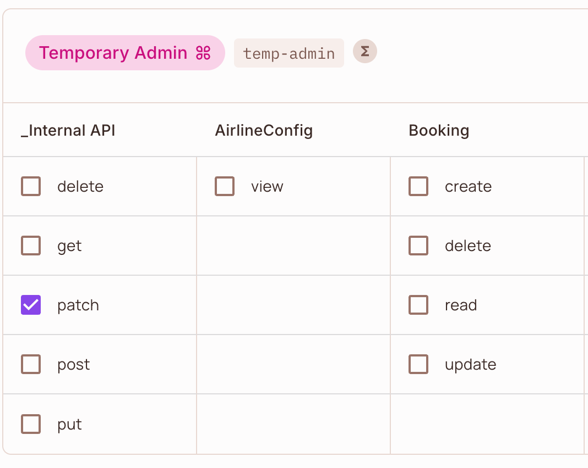
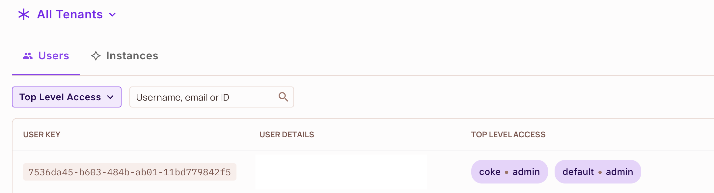

# Time Based Groups and Custom Data Source for Permit.io

This applicaiton is an example of a simple http data fetcher for Permit.io. It uses nginx to reverse proxy the [`docker/data/data.json`](./docker/data/data.json) file. Below are the instructions used to configure Permit.io to use this data fetcher for time based groups.

## Prerequisites and assumptions

- Docker
- Docker Compose
- [Permit.io account](https://permit.io/), project, and environment
- [Permit.io GitOps integration enabled and activated](https://docs.permit.io/integrations/gitops/github)
- Users, resources, and roles are created in the Permit. This example does not pull in users or roles from a custom data source, but rather maps existing user roles to time based constraints. 
- This API mocks an internal api call that would both assign the user the role in Permit and create the expiration rule in a datastore. 
- There is no cleanup effort in this example. When the user is assigned a role, if a time based expiration is not added to the data.json file, the user will have the role indefinitely. To remove the role you will need to remove it from the user in Permit.


## Running this project

1. Clone the repository
1. Create a `.env` file based on the `.env.example` file
    - `PDP_API_KEY` is your[ Permit.io environment API key ](https://docs.permit.io/manage-your-account/projects-and-env#fetching-and-rotating-the-api-key)
1. Run `docker compose up`

## Configuring Permit.io
Now that this project is running, let's configure Permit.io to use it.

### Add a custom data source
Make the following API call to Permit.io to [add a custom data source](https://docs.permit.io/how-to/manage-data/use-external-data-source).
1. Replace `{project_id}` and `{environment_id}` with your project and environment ids.
1. Replace `permit_key_` with your Permit.io API key.


```bash
curl --location --request PUT 'https://api.permit.io/v2/projects/{project_id}/{environment_id}/opal_scope' \
--header 'Content-Type: application/json' \
--header 'Accept: application/json' \
--header 'Authorization: Bearer permit_key_' \
--data '{
    "data": {
        "entries": [
            {
                "url": "http://custom_data_source_server/data.json",
                "dst_path": "/data.json",
                "config": {
                    "headers": {
                        "Accept": "application/json"
                    }
                }
            }
        ]
    }
}' 
```
#### Notes
- The `dst_path` is the path in the Permit.io data model where the data will be stored in OPA.
- The `url` is the path to the data on this server. This is configurable in [docker-compose.yml](./docker-compose.yml) which uses Docker's internal network where containers can communicate using their service names as hostnames (e.g., `http://custom_data_source_server/data.json`).

### Map the new data to the user object via Custom Rego
1. Navigate to your project repository in Git and select the correct branch for the environment you are working in.
    - The branch name will be something like `permit/generated/{environment_id}`
1. Open the `/custom/root.rego` file and add the below after the `default allow := false` line.
    ```

    custom_user_attributes["time_based_groups"] := data["data.json"].user_roles_expires[input.user.key][input.resource.tenant] 
    ```
    - Notes
        - This maps the `user_roles_expires` key in the custom data source to the `time_based_groups` key in the Permit user object. It can then be used in policies the same way you would use any other user attribute.
        - `data["data.json"]` is the `dst_path` to the custom data source API call we created earlier.
        - `user_roles_expires` is the key in the custom data source where the time based group assignments are stored.
        - `[input.user.key]` is the key of the user you are checking permissions for.
        - `[input.resource.tenant]` is the current tenant of the resource you are checking permissions for.

### Create a User condition_set (RBAC + ABAC Role)
To utilize the new `time_based_groups` user attribute in a policy, you must create a [condition_set](https://docs.permit.io/api/working-with-abac/condition-sets) with the `time_based_groups` attribute.

1. Call the [condition_set API](https://docs.permit.io/reference/condition-sets#create-a-condition-set) to create the condition_set.
    ```bash
        curl --location 'https://api.permit.io/v2/schema/{project_id}/{environment_id}/condition_sets' \
        --header 'Content-Type: application/json' \
        --header 'Accept: application/json' \
        --header 'Authorization: Bearer permit_key_' \
        --data '{
            "key": "temp-admin",
            "name": "Temporary Admin",
            "type": "userset",
            "conditions": {
                "allOf": [
                    {
                        "allOf": [
                            {
                                "user.roles": {
                                    "array_contains": "admin"
                                }
                            },
                            {
                                "user.time_based_groups": {
                                    "any_match": {
                                        "match": {
                                            "expires": {
                                                "greater-than-equals": {
                                                    "ref": "user.current_time"
                                                }
                                            }
                                        }
                                    }
                                }
                            }
                        ]
                    }
                ]
            }
        }'
    ```
1. The creation of the condition_set will add a new `Role` under the Policy Editor tab in the UI called `Temporary Admin`. Assign the correct resource actions to the new User Role. In the example below the `patch` action is selected on the `_Internal API` resource.
    - 
1. Next is to pass the `current_time` variable in the user object via the `permit.check()` function in the SDK or the PDP `/allowed` endpoint.
    - [Permit.js SDK](https://docs.permit.io/how-to/enforce-permissions/check/)
        - ```javascript
            const permitted = await permit.check(
            {
                key: "7536da45-b603-484b-ab01-11bd779842f5",
                // to use unix epoch time, use the following syntax
                attributes: {
                    current_time: new Date().getTime()
                },
            },
            // the action the user is trying to do
            "patch",
            // Resource
            {
                // the type of the resource (the resource key)
                type: "internal_api",
                // the tenant the resource belong to
                tenant: "coke",
            }
            );
        ```
    - [PDP /allowed endpoint](https://pdp-api.permit.io/redoc#tag/Authorization-API/operation/is_allowed_allowed_post)
        - ```bash
            curl --location 'http://localhost:7766/allowed' \
            --header 'Content-Type: application/json' \
            --header 'Accept: application/json' \
            --header 'Authorization: Bearer permit_key_' \
            --data '{
                "user": {
                    "key": "7536da45-b603-484b-ab01-11bd779842f5",
                    "attributes": {
                        "current_time": 1732652217904
                    }
                },
                "action": "patch",
                "resource": {
                    "type": "internal_api",
                    "tenant": "coke"
                }
            }'
        ```
    - Notes
        - In this example, the `current_time` value must be the current unix epoch time in milliseconds. To update the expiration, you will need to update the `data.json` file and redeploy the docker container.
        - The `action` and `resource` are the action and resource the user is trying to do.
## Testing
1. To test the time based groups, you can create a new user in Permit and assign the `admin` role in the correct tenants (i.e. `coke` and `default`). 


1. You can then update the [`data.json`](./docker/data/data.json) file to add a time based expiration to the user role for each tenant.

1. Make a call via the SDK or PDP `/allowed` endpoint to check if the user has the role. If before the expiration time, the user will have the role and the call will return `true`. If after the expiration time, the user will not have the role and the call will return `false`.
